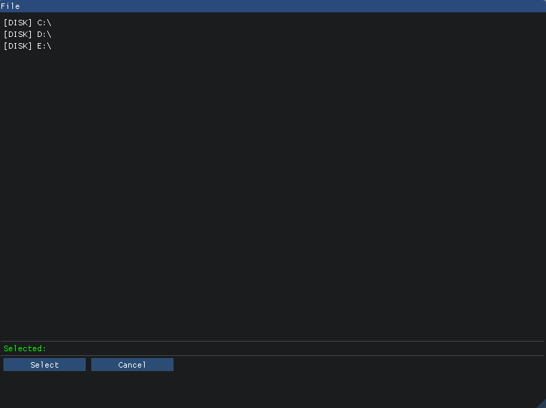

# Simple File Dialog for imGUI library

Under coding. Stay tuned.
Bugs? Suggestions? Feel free to PM me or modify and commit code ;)

Example:

```cpp
#include "FileDialog.h"

using FD = ImGuiFileSystem::FileDialog< ImGuiFileSystem::FileDialogImpl >;
...

FD::GetInstance().Open( [](std::string const& selected_path) { /* process selected path */ } );

```

